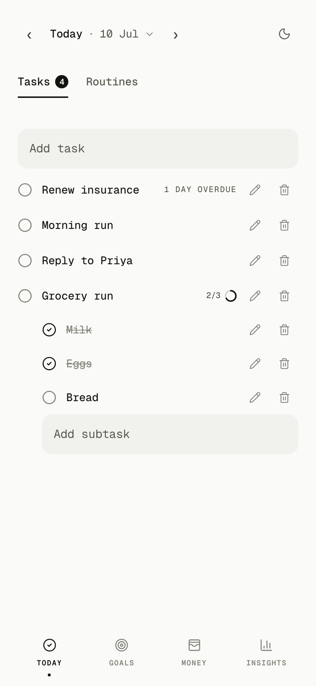
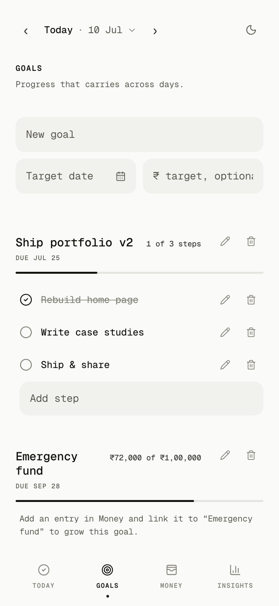
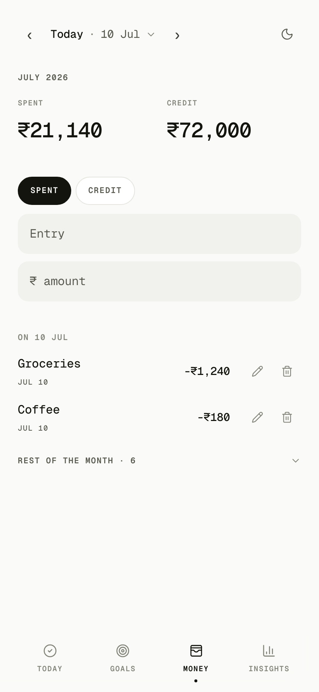
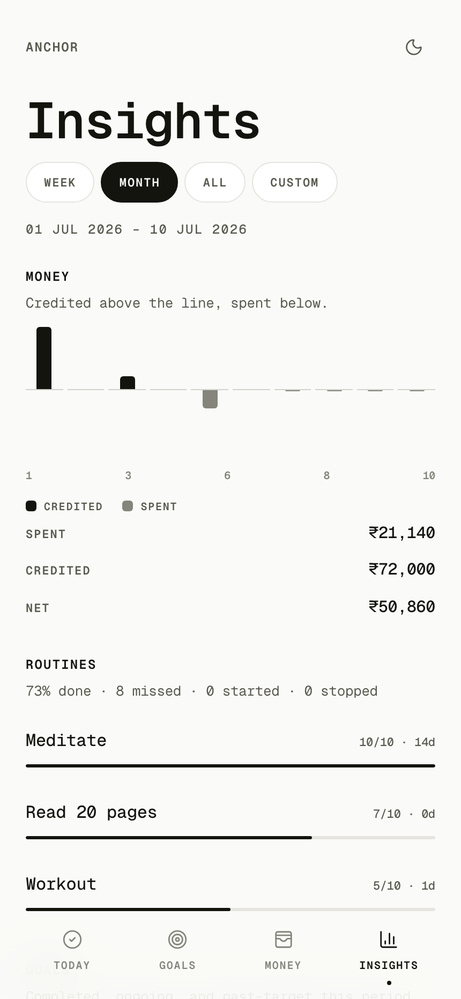

<div align="center">
  

  # Anchor

  **A calm, private place to run your day.**

  Tasks, routines, goals, and money — tracked day by day, entirely on your device.
  No account. No cloud. No noise.
</div>

---

## What it is

Anchor is a local-first daily tracker. Everything you add — today's tasks, the routines you're
building, the goals you're chasing, every rupee in and out — lives **only in your browser**, on your
device. There is no sign-up, no server, and it works fully offline as an installable app.

It's built around a single idea: open it, see today, and move. One screen, one day, a quiet
monochrome interface that gets out of the way.

## Screenshots

| Today | Goals | Money | Insights |
|:---:|:---:|:---:|:---:|
|  |  |  |  |

## Features

**Today** — One compact screen for the day. The date bar at the top opens a calendar on tap; step days
with `‹ ›`, and a *Today* shortcut snaps you back to now. **Tasks** and **Routines** live under a quick
toggle so each stays uncluttered.

**Tasks** — One tap to complete, inline rename and delete. Anything you didn't finish **carries forward
as overdue** until you clear it, so nothing quietly disappears. Turn any task into a **checklist** —
add subtasks and the parent shows a small progress ring (e.g. 2/3); revert it back to a single item any
time.

**Routines** — Repeatable checks that carry across days. Build a habit and check it off each day; the
Insights tab tracks your streaks and how often you keep them.

**Goals** — Longer arcs that span many days. Task goals track step-by-step progress; money goals grow
as you link credited entries toward a savings target. Each goal shows a live progress bar and due date.

**Money** — Log spending and credits in rupees and see the month's totals at a glance. Entries are
**grouped by day** — the selected day sits on top, with the rest of the month tucked into a collapsible
section. Link credits to a savings goal; spent entries can't distort a goal — only credits move it
forward.

**Insights** — Analytics over a **week, month, all-time, or a custom range**. A diverging chart shows
credited vs. spent over time (bucketed adaptively by day, week, month, or year so it stays readable at
any span), plus routine completion and streaks, and a breakdown of goals completed, ongoing, and
past-target.

## Privacy & your data

- **100% local** — data is stored in your browser via IndexedDB (Dexie). Nothing leaves your device.
- **No account, no tracking, no network calls** for your data.
- **Yours to move** — export everything to a JSON file, import it back, or reset your local workspace
  at any time.

## Install as an app

Anchor is a PWA. In a supported browser, open it and choose **Install / Add to Home Screen** — it runs
standalone, offline, with its own icon. Light and dark themes are both fully designed; toggle with the
moon/sun in the header.

## Design

A strictly monochrome system — ink on warm paper, zero color — where **type and contrast do the work**.
Everything is set in **Geist Mono** with one consistent tracking scale, whitespace instead of divider
lines, and quiet motion. Built mobile-first.

## Tech

React 19 · TypeScript · Vite · Tailwind CSS v4 · Zustand · Dexie (IndexedDB) · React Hook Form · Zod ·
vite-plugin-pwa · Geist Mono.

---

## Development

```bash
npm install
npm run dev      # start the dev server
npm run build    # type-check + production build
npm run lint     # oxlint
npm run preview  # preview the production build
```

Everything runs client-side; there is no backend to configure.
